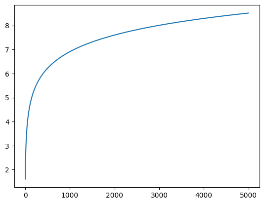
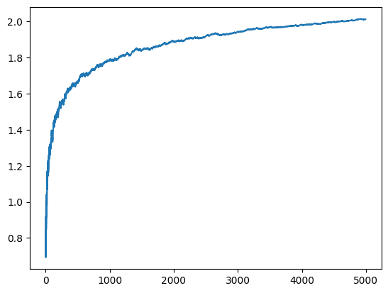
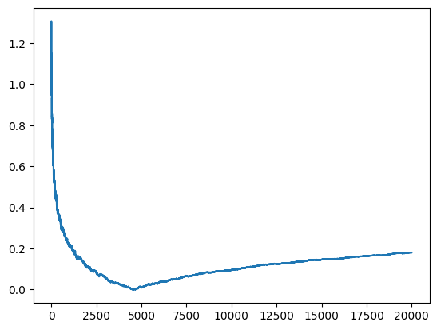
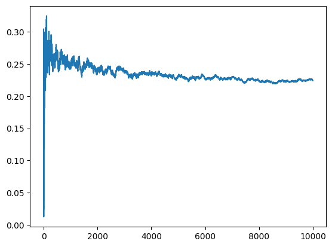

# Prime Count -- Dynamic Formula

I have created a formula for prime counting.
It counts the differences and finds the values. The formula is as below

```Python

def prime_sum_fomrula(self):
        x = 0
        for i in range(len(self.prime_nums)):
            arr = self.prime_nums.copy()
            x += arr[i]-arr[i-1]
            x -= x / arr[i]
        return 1- x / self.n
    
```

We could try to optimize the x increase but eventually we can define a system of increase and decrease.

However this is an upper bound and with 5000 value the result is 

<span style="color:coral"> for n 5000 the ratio of primes 0.18 </span>

I have changed the function and add log to two values then the result is 


```Python

primeSum = PrimeSime()
arr = []
error = []
for i in range(10,100000):
    primeSum.define_primes(i)
    y_pred = primeSum.prime_sum_fomrula() *i 
    y_pred = math.log(y_pred) 
    y = primeSum.prime_count()
    y = math.log(y)
    print(y_pred,y)
    arr.append(y_pred)
    error.append(abs(y_pred-y))

primeSum.plot_arr(arr)
primeSum.plot_arr(error)

```


## Formula Logic

In the formula 

```Python
def prime_sum_fomrula(self):
        x = 0
        for i in range(len(self.prime_nums)):
            arr = self.prime_nums.copy()
            x += arr[i]-arr[i-1]
            x -= x / arr[i]
        return 1- x / self.n
```

since 2 divides the values and half of them is not prime. When we get 3 prime we learn that 1/3 of the values are not prime and so on. then we calculate the ratio like that which are ***non prime numbers***. Then 1- ratio gives the prime numbers in rough.

```math
x = 0 \\[10px]
\sum_{n=0}^{n=\infty} (x + (p_{n} - p_{n-1})) - \frac{x}{p_{n}} = S \\[10px]

```

These calculation lead us to **non prime numbers**


```math
x = 0 \\[10px]
\sum_{n=0}^{n=\infty} (x + (p_{n} - p_{n-1})) - \frac{x}{p_{n}} = S \\[10px]

1 - S = primes

```

## Change of Function

I changed the function and result is 

```Python

class PrimeSime(NumberSum):

    def __init__(self):
        super().__init__()


    def prime_sum_fomrula(self):
        x = 0
        for i in range(len(self.prime_nums)):
            a = random.choice((2,4,6,8,10))
            val = a
            for j in range(1,val):
                if a > j:
                    a -= (val / j)

            x += a
        return 1- abs(x / self.n)

    def prime_count(self):
        return len(self.prime_nums)
 
    
    def plot_arr(self,arr):
        sns.lineplot(arr)
        plt.show()
        

```
as you can see, prime numbers are not needed for the process and when we log the results, plot is like this:




### Mathematical formula

we can state that 

```math
x = 0 \\[10px]
\sum_{x=S}^{S=\infty} (x + (6)) - \frac{x}{21} = S \\[10px]


ln((1-(\frac{S}{n})) \cdot n) - ln(\pi(n)) = 2 \\[10px]
\frac {(n-S)}{\pi(n)} = e^{2} \\[10px]
\pi(n) = \frac {(n-S)}{e^{2} }


```

let's test that...

```Python

def prime_sum_fomrula(self):
        x = 0
        for i in range(len(self.prime_nums)):
            a = random.choice((2,4,6,8,10))
            val = a
            for j in range(1,val):
                if a > j:
                    a -= (val / j)

            x += a
        return (self.n - x) / (math.e)**2

```

this adjustment converges to 1 but then increases with log. Eventually, there is a such equality and we can show that like this




## More Precisely

```math
x = 0 \\[10px]
\sum_{x=S}^{S=\infty} (x + (6)) - \frac{x}{21} = S \\[10px]


ln(\frac{n-S}{e^{2}}) - ln(\pi(n)) = \epsilon \\[10px]
ln(\frac{n-S}{e^{2} \cdot \pi(n)}) = \epsilon \\[10px]

\frac{n-S}{e^{2} \cdot \pi(n)} = e^{\epsilon} \\[10px]

\pi(n) = \frac {(n-S)}{e^{2+\epsilon} } \\[10px]

\text{more likely this could be like this with fixation of former eq.} \\[10px]

\pi(n) = \frac {(n-S)}{\epsilon^{2+\epsilon} }

```


We need an adaptive algorithm to calculaute the ratio then;

```Python

def prime_sum_fomrula(self,error_avg):
        x = 0
        for i in range(len(self.prime_nums)):
            a = random.choice((2,4,6,8,10))
            val = a
            for j in range(1,val):
                if a > j:
                    a -= (val / j)

            x += a
        
        return (self.n - x) / (error_avg)**(2*error_avg)
    def prime_count(self):

```

We get the error_avg from target and probably in formula 

```Python

return (self.n - x) / (math.e)**error_avg

```

This could be final determinant process.

## Randomized Values for Prime Count

Rather than using **error_avg** we can randomly select our values. This could like this.

```Python
def prime_sum_fomrula(self):
        x = 0
        for i in range(len(self.prime_nums)):
            a = random.choice((2,4,6,8,10))
            val = a
            for j in range(1,val):
                if a > j:
                    a -= (val / j)

            x += a
        
        error_rate = random.uniform(0.1,1)
        return (self.n - x) / (math.e)**(error_rate)
```

error rate is equal to a random uniform value between 0.1 and 1 then, we get the such figures.


Therefore we could determine that this would lead an **ratio** which clould be 
1.5 or 2 according to n value.

Final Formula is looks like this

```Python

error_rate = random.uniform(0.1,1)
log_n = math.log(self.n)
return ((self.n - x) / (math.e)**(error_rate)) / log_n
```

this returns a stable plot


Then I checked the average value and it is 

```Python
sum(error) / len(error)
0.67
```

it is 0.67 then

```math

x = 0 \\[10px]
(\sum_{x=S}^{x=n} (x + (6)) - \frac{x}{21}) = S \\[10px]

ln(\frac{n-S}{e^{\epsilon} \cdot ln(n)}) - \pi(n) = 0.67 \\[10px]
\pi(n) = ln(\frac{n-S}{e^{\epsilon} \cdot ln(n)}) -  0.67

```

However better  system is like this

```Python
error_rate = 0.1
log_n = math.log(self.n)
return (((self.n - x) / (math.e)**(error_rate)) / log_n) - error_rate

```

this returns a stable 0.25 error value...

```math

x = 0 \\[10px]
(\sum_{x=S}^{x=n} (x + (6)) - \frac{x}{21}) = S \\[10px]

ln(\frac{n-S}{e^{\epsilon} \cdot ln(n)}) -\epsilon - \pi(n) = \beta \\[10px]
\pi(n) = ln(\frac{n-S}{e^{\epsilon} \cdot ln(n)}) -  \epsilon  -\beta

```

for epsilon values, beta values change and final 0.1 plot is




## Summary

* We define prime gaps as 2,4,6,8,10 or more with n, we can define a dynamical gap between them(another idea)
* Normally we need to divide the value with primes however make it smaller with other values. This is hard to proof but we get smaller the a value rather than -2/prime values.

* Others are numerical analysis calculations from graph

```Python

error_rate = 0.1
log_n = math.log(self.n)
return (((self.n - x) / (math.e)**(error_rate)) / log_n) - error_rate

```

## FINAL FORMULA

I realized that x doesn't matter and x = 1 is great for the low error calculation. Then we can measure the prime count as

Then formula is 


```Python
 def prime_sum_formula(self):
        x = 1
        
        error_rate = 0.1
        beta = 0.1
        log_n = math.log(self.n)
        return ((((self.n - x) / (math.e)**(error_rate)) / log_n) - error_rate)

```

```math
\beta = ln(ln(\frac{n-1}{e^{\epsilon} \cdot ln(n)}) -  \epsilon )-\ln(\pi(n)) \\[10px]


e^\beta = \frac{(ln(\frac{n-1}{e^{\epsilon} \cdot ln(n)}) - \epsilon)}{\pi(n)}\\[10px]


 \pi(n)= \frac{(ln(\frac{n-1}{e^{\epsilon} \cdot ln(n)}) - \epsilon)}{e^\beta}\\[10px]

```

This is probably the final formula for the prime count


## Final Prime Count Function

I iterated and modified the function and eventually this is the final form of function:

```Python
def prime_sum_formula(self):
        x = 1
        
        error_rate = 0.0005
        beta = 0.0001
        log_n = math.log(self.n)
        val = ((((self.n - x) / (math.e)**(error_rate)) / log_n) - error_rate)

        val = val / (math.e)**(beta)
        val = val + val*error_rate
        return val

```

you can change x to 1 or 0 does not reflect at all to formulation. **It is close to prime number and it is a lower bound for prime count**.


## Results

Lastly, I returned main method and main functionality. However this is redundant because we use prime numbers to count prime numbers.


```Python

def prime_sum_formula(self):
    x = self.n
    
    val = 0
    for i in range(2,self.n):
        if sympy.isprime(i):
            x -= x / i
            val = i

    return abs(x*2 + 7)
    
```

```math
 
x = n \\[10px]

a1 = n - \frac{n}{2} \\[10px]
a2 = \frac{n}{2} - \frac{n}{6} \\[10px]
a3 =\frac{2n}{6} - \frac{n}{30} \\[10px]
a4 =\frac{9n}{30} - \frac{n}{210} \\[10px]
...
```
eventually we sum the n 2n 3n 5n and we get a series like

```math
2n - n \\[10px]
3(2n - n)-n \\[10px]
5(3(2n - n)-n)-n \\[10px]
\frac{7(5(3(2n - n)-n)-n)-n}{2 \cdot 3 \cdot 5 \cdot 7}\\[10px]
..

```


<span style="color:coral"> Since this is an experiement, I couldn't find anything better than current n / lnn combination. When I collect the primes and calculate the ratio, then we also do that counting while calculating. Since this is an contridiction, deciding the count from that is not meaningfull. For now.</span>


